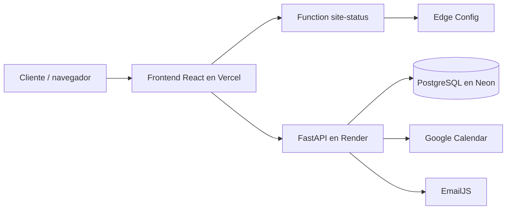

# Arquitectura

## Objetivo

Sebas Barber separa la experiencia pública de reserva de la operación
administrativa. La API es la autoridad para disponibilidad, reglas de
negocio, autorización y persistencia. El frontend consume contratos HTTP y
no debe replicar decisiones críticas del servidor.

## Topología de producción



El navegador puede usar EmailJS para confirmaciones inmediatas. Las tareas de
Render usan la integración del backend para recordatorios y operaciones que
no dependen de la sesión del usuario.

## Capas del backend

```text
HTTP request
  └── controllers/routers
        ├── validación Pydantic en schemas.py
        ├── servicios de dominio en services/
        ├── repositorios y SQLAlchemy en repositories/
        └── models.py / PostgreSQL
```

### Responsabilidades principales

- `main.py`: ciclo de vida FastAPI, base de datos, seed, CORS, rate limit,
  headers de seguridad y normalización de errores.
- `public_controller.py`: bootstrap, servicios y estado público.
- `bookings.py`: disponibilidad, creación, consulta, cancelación y
  reprogramación de citas.
- `admin_controller.py`: autenticación y operaciones del panel.
- `operations_controller.py`: configuración, pausas, clientes, promociones,
  gastos, caja, notificaciones y respaldos.
- `engagement_controller.py`: lista de espera, reseñas y feedback.
- `tasks_controller.py`: recordatorios y retención protegidos por token.
- `services/`: autenticación, códigos, calendario, fechas, correo, rate
  limiting, cache, auditoría, retención y Cloudinary.

## Capas del frontend

- `App.jsx`: composición de rutas y estado global.
- `components/`: UI pública, wizard, modales y panel administrativo.
- `api/client.js`: cliente HTTP y normalización de errores.
- `services/`: integraciones del navegador, especialmente EmailJS.
- `hooks/`: comportamiento reutilizable y accesibilidad.
- `utils/`: fechas, formatos, CSV y almacenamiento local.
- `styles.css`: sistema visual global y responsive.

## Aislamiento por barbero

Cada usuario administrativo se resuelve a un registro de `barbers`. Los
endpoints administrativos reciben el JWT y cargan el barbero asociado. Las
consultas y mutaciones utilizan ese `barber_id`; si un recurso pertenece a
otro barbero, la API responde `403` o `404` según el caso de uso.

La separación se aplica a citas, horarios, bloqueos, clientes, reportes,
gastos, caja, reseñas, galería, promociones, auditoría y calendario.

## Flujo de reserva

1. El frontend solicita el bootstrap público y los servicios activos.
2. El cliente elige barbero, servicio, fecha y hora.
3. `GET /api/availability` consulta bloqueos, citas locales y calendario
   externo cuando corresponde.
4. `POST /api/appointments` valida de nuevo todos los datos en el servidor.
5. La transacción impide duplicados y conserva la cita local.
6. Si el perfil tiene sincronización activa, se crea el evento externo en
   `America/Costa_Rica`.
7. La respuesta devuelve la cita y su clave de administración.
8. El frontend muestra confirmación y dispara los avisos configurados.

Nunca se debe confiar en que un slot disponible en una respuesta anterior
seguirá libre al enviar la reserva.

## Calendario y consistencia

Los calendarios se seleccionan desde la configuración del barbero. Las fechas
se generan en `America/Costa_Rica` y los eventos se envían en RFC3339. Crear,
cancelar y reprogramar actualizan la cita local y el evento externo según la
configuración disponible.

La disponibilidad se valida en el servidor; `request_id` y
`request_fingerprint` permiten idempotencia; los índices aceleran búsquedas
por barbero, estado, fecha y teléfono.

## Modo mantenimiento

`frontend/api/site-status.js` lee únicamente los campos permitidos desde Edge
Config. El frontend muestra `MaintenancePage` cuando
`maintenance_enabled` es `true`. La ruta `/admin` permanece disponible para
que los barberos puedan operar durante la pausa.

## Seguridad

- secretos del backend únicamente por variables de entorno;
- JWT con emisor y audiencia definidos;
- CORS limitado a producción y desarrollo local;
- headers de seguridad, CSP, HSTS bajo HTTPS y `Cache-Control: no-store` en
  administración;
- rate limiting y límite de payload;
- errores internos sin trazas para el cliente;
- auditoría de operaciones administrativas;
- códigos de reserva almacenados mediante hash y cifrado cuando aplica.
